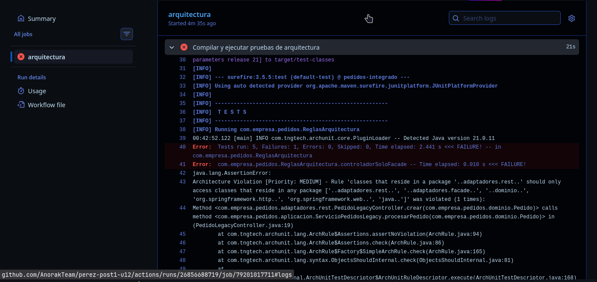
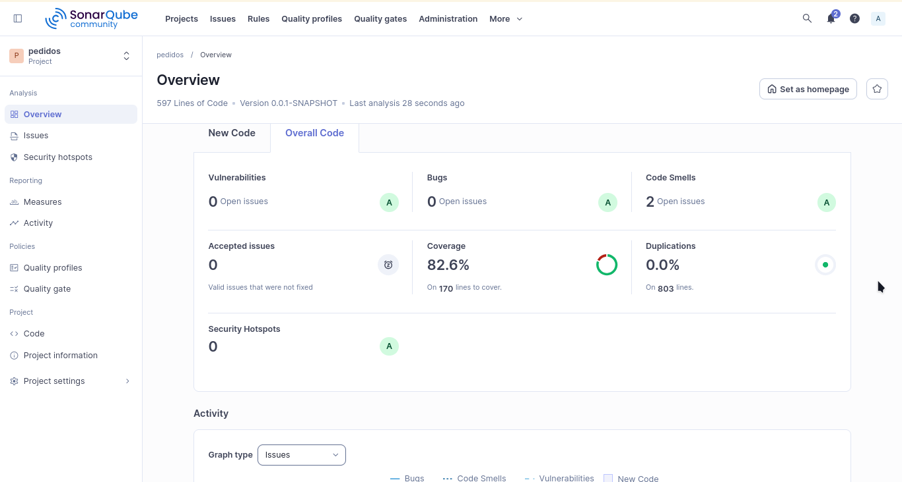

# Sistema de pedidos con arquitectura hexagonal, ArchUnit y CI/CD
Estudiante: José Manuel Pérez Rodríguez
Código: 1152375

Este proyecto refleja la versión actual del sistema de pedidos después de la refactorización avanzada, la validación arquitectónica con ArchUnit y la integración de documentación técnica (ADR) y automatización con GitHub Actions.

### Contexto
El sistema se desarrolla en Spring Boot con una arquitectura hexagonal que separa dominio, aplicación, adaptadores e infraestructura. Además de los patrones Factory, Strategy, Observer y Facade, se añadió una validación automática de reglas de arquitectura y documentación de decisiones de diseño en formato ADR.

## Estado actual del proyecto
La versión actual incorpora:
- refactorización del controlador legacy para evitar exponer la entidad JPA directamente,
- reglas ArchUnit en src/test/java/com/empresa/pedidos/ReglasArquitectura.java,
- ADRs en docs/adr/,
- workflow de validación en .github/workflows/arquitectura.yml.

La calidad del código se continúa evaluando con SonarQube y con las pruebas automatizadas del pipeline.

## Reflexión

Este proyecto demuestra cómo la integración de patrones de diseño, validación arquitectónica y documentación técnica mejora la organización del sistema de pedidos. La separación entre dominio, aplicación e infraestructura facilita el mantenimiento, las pruebas y la evolución del sistema sin introducir acoplamiento excesivo.

## ADR añadidos
Se documentaron tres decisiones clave en la carpeta docs/adr/:
- ADR-001: Arquitectura Hexagonal para aislar el dominio.
- ADR-002: Factory + Strategy para la selección del procesador.
- ADR-003: Spring Events (Observer) para notificaciones.

## Validacion Arquitectonica
La validación automatizada se implementa en src/test/java/com/empresa/pedidos/ReglasArquitectura.java con cinco reglas ArchUnit:
1. El dominio no debe depender de infraestructura ni adaptadores.
2. Los controladores REST solo deben acceder a la fachada y al dominio, además de Spring Web y tipos Java.
3. Los puertos del dominio deben ser interfaces.
4. Los procesadores concretos deben implementar la interfaz ProcesadorPedido.
5. La infraestructura no debe acceder directamente a la capa REST.

Estas reglas se ejecutan como parte de la verificación del proyecto y también en CI mediante el workflow de GitHub Actions.

## Ejecución de código y pruebas

### Código
Desde la raíz del proyecto:

```bash
./mvnw spring-boot:run
```

### Pruebas locales
Ejecuta la validación arquitectónica y la suite completa con:

```bash
./mvnw -Dtest=ReglasArquitectura test
./mvnw verify
```

### Integración continua
El workflow de GitHub Actions está definido en .github/workflows/arquitectura.yml y ejecuta:
1. la validación de ArchUnit,
2. la suite completa de pruebas con Maven.

### Análisis con SonarQube
Para ejecutar el análisis en un servidor SonarQube local:

```bash
./mvnw clean verify org.sonarsource.scanner.maven:sonar \
  -Dsonar.projectKey=com.empresa:pedidos \
  -Dsonar.projectName='pedidos' \
  -Dsonar.host.url=http://localhost:9000 \
  -Dsonar.token={TOKEN_GENERADO_SONARQUBE}
```

## Capturas de verificación

> (Nota: se puede ver el check en verde al lado del mensaje del commit para confirmar que funciona el workflow de Actions)



